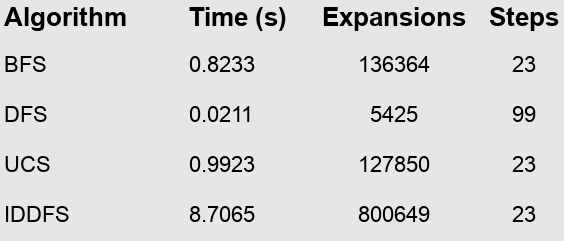
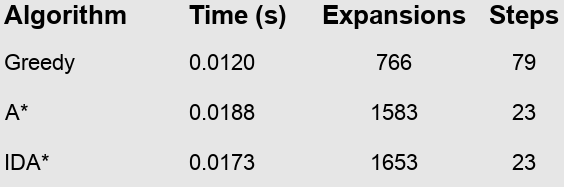
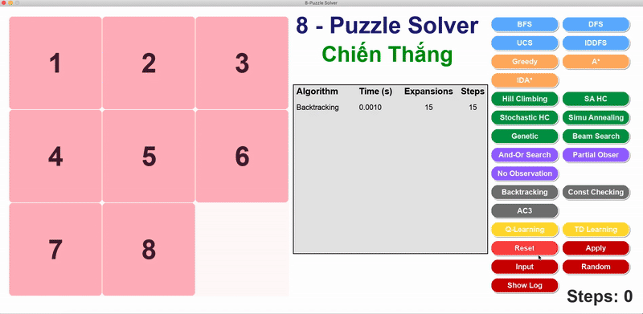
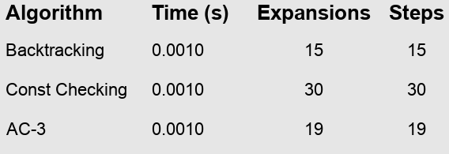
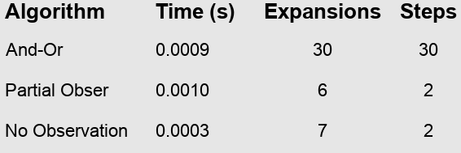
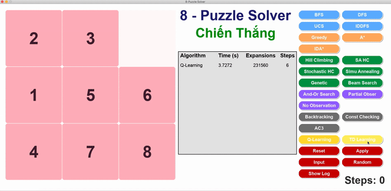
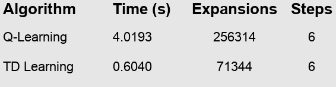
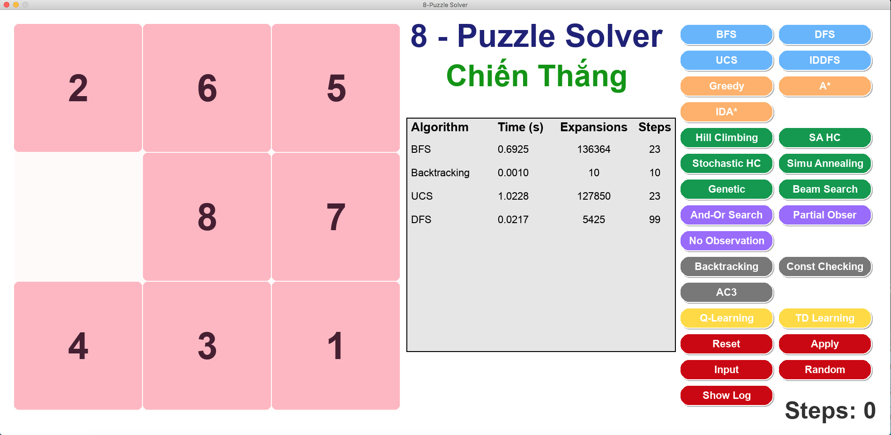

# 🧩 8-Puzzle Visualizer – Trình mô phỏng giải thuật AI với Pygame

## 1. 🎯 Mục đích dự án

Dự án **8-Puzzle Visualizer** được phát triển nhằm:

- 🔍 **Ứng dụng các thuật toán AI đã học**  
  Thực hiện và kiểm thử nhiều thuật toán tìm kiếm khác nhau trong bài toán xếp ô 8-puzzle, bao gồm từ các thuật toán cơ bản như BFS, DFS cho đến nâng cao như A*, IDA*, Hill Climbing, Beam Search, Genetic Algorithm và Q-Learning.

- 🎮 **Xây dựng giao diện mô phỏng bằng Pygame**  
  Giao diện đồ họa sử dụng thư viện Pygame, trực quan sinh động. Người dùng có thể nhập trạng thái khởi đầu, chọn thuật toán từ các nút tương tác, xem quá trình giải từng bước với hiệu ứng, và theo dõi các chỉ số như số bước, số nút mở rộng và thời gian xử lý.

- 📊 **So sánh hiệu năng thuật toán**  
  Hệ thống thống kê thời gian chạy, số bước di chuyển và số lượng node được mở rộng giúp người dùng đánh giá hiệu quả từng thuật toán trong việc tìm lời giải.

- 🎓 **Tăng cường khả năng học tập**  
  Hỗ trợ sinh viên hiểu rõ cách hoạt động bên trong của từng thuật toán thông qua trực quan hóa, từ đó củng cố kiến thức lý thuyết và cải thiện kỹ năng lập trình giải thuật.

---

## 2. 📌 Nội dung tổng quan

Dự án giải quyết bài toán **8 ô số (8-Puzzle)** – một bài toán cổ điển trong AI, yêu cầu đưa các ô số về đúng vị trí bằng cách di chuyển ô trống. Hệ thống tích hợp **6 nhóm giải thuật chính**:

- 🔹 **Tìm kiếm không sử dụng thông tin (Uninformed Search)**  
  Gồm các thuật toán duyệt không gian trạng thái mà không sử dụng heuristic:
  - **BFS** (Breadth-First Search)  
  - **DFS** (Depth-First Search)  
  - **UCS** (Uniform Cost Search)  
  - **IDDFS** (Iterative Deepening DFS)

- 🔹 **Tìm kiếm có thông tin (Informed Search)**  
  Áp dụng heuristic (Manhattan Distance) để dẫn hướng tìm kiếm:
  - **Greedy Search**  
  - **A\*** (A-Star Search)  
  - **IDA\*** (Iterative Deepening A*)

- 🔹 **Tìm kiếm cục bộ (Local Search)**  
  Tối ưu cục bộ thông qua cải tiến liên tục trạng thái:
  - **Simple Hill Climbing**  
  - **Steepest Ascent Hill Climbing**  
  - **Stochastic Hill Climbing**  
  - **Simulated Annealing**  
  - **Beam Search**  
  - **Genetic Algorithm**

- 🔹 **Tìm kiếm ràng buộc (Constraint Satisfaction Search)**  
  Giải bài toán bằng cách gán giá trị cho biến thỏa các ràng buộc:
  - **Backtracking CSP**  
  - **Constraint Checking**  
  - **AC-3** (Arc Consistency 3)

- 🔹 **Tìm kiếm trong môi trường không xác định**  
  Dành cho các bài toán mà trạng thái hoặc kết quả hành động không chắc chắn:
  - **No Observation Search**  
  - **Partial Observable Search**  
  - **AND-OR Search**

- 🔹 **Học tăng cường (Reinforcement Learning)**  
  - **Q-Learning**: Giúp tác nhân học chính sách giải bài toán 8-Puzzle thông qua trải nghiệm thử-sai và cập nhật giá trị hành động dựa trên phần thưởng nhận được.
  - **TD Learning**: Học giá trị trạng thái theo hướng tiếp cận từng bước (temporal difference), kết hợp giữa kinh nghiệm hiện tại và ước lượng trong tương lai.


### Mỗi thuật toán được hiển thị với:

- ✏️ **Cấu trúc bài toán**: Trạng thái dạng tuple 3x3, định nghĩa hành động (lên, xuống, trái, phải), điều kiện đích và chi phí di chuyển.
- 🔁 **Lộ trình giải**: Dãy bước đi từ trạng thái đầu đến trạng thái đích.
- 🎞️ **Hiệu ứng hoạt họa**: Mỗi bước di chuyển được mô phỏng mượt mà trên giao diện Pygame.
- 📈 **Thống kê kết quả**: Thời gian chạy, số bước thực hiện, số lượng node mở rộng.
- 💬 **Đánh giá thuật toán**: So sánh các phương pháp dựa trên tốc độ, độ chính xác và mức sử dụng bộ nhớ.
---
## 2. Triển khai thuật toán giải 8-Puzzle

### 2.1. Tìm kiếm không sử dụng thông tin (Uninformed Search)

#### Đặc điểm bài toán 8-Puzzle

- **Trạng thái ban đầu**  
  Một tổ hợp hợp lệ của các số từ 0 đến 8, biểu diễn dưới dạng tuple 9 phần tử (ma trận 3x3). Ví dụ: `(2, 6, 5, 0, 8, 7, 4, 3, 1)`.

- **Trạng thái đích**  
  Mục tiêu là sắp xếp các ô theo thứ tự tăng dần: `(1, 2, 3, 4, 5, 6, 7, 8, 0)` với ô trống (0) nằm ở cuối.

- **Không gian trạng thái**  
  Gồm tất cả các trạng thái có thể tạo ra bằng cách di chuyển ô trống theo các hướng hợp lệ. Tổng số tổ hợp là 9! = 362,880.

- **Tập hành động**  
  Gồm 4 thao tác di chuyển ô trống: lên, xuống, trái, phải – tùy thuộc vào vị trí hiện tại của nó.

- **Hàm chuyển trạng thái**  
  Di chuyển ô trống tới vị trí mới bằng cách hoán đổi với một ô lân cận, từ đó tạo ra trạng thái mới.

- **Hàm chi phí**  
  Mỗi hành động được gán chi phí bằng 1. Tổng chi phí chính là số bước đi từ đầu đến đích.

#### Các thuật toán được triển khai

##### 🔍 **Breadth-First Search (BFS)**  
- Duyệt theo từng lớp, mở rộng các trạng thái theo độ sâu tăng dần từ gốc.  
- Ưu điểm: luôn tìm được lời giải với số bước ít nhất nếu tồn tại.  
- Nhược điểm: tiêu tốn nhiều bộ nhớ nếu trạng thái lớn.  


##### 🔍 **Depth-First Search (DFS)**  
- Duyệt theo chiều sâu, mở rộng đến tận cùng một nhánh trước khi quay lại.  
- Ưu điểm: bộ nhớ thấp, chạy nhanh nếu lời giải gần gốc.  
- Nhược điểm: không đảm bảo tối ưu, dễ đi lạc nếu không giới hạn độ sâu.  


##### 🔍 **Uniform-Cost Search (UCS)**  
- Mở rộng trạng thái có tổng chi phí nhỏ nhất từ gốc đến hiện tại.  
- Ưu điểm: đảm bảo tìm đường đi có chi phí thấp nhất.  
- Nhược điểm: nếu chi phí đều như nhau thì giống BFS và tiêu tốn tài nguyên hơn.  


##### 🔍 **Iterative Deepening DFS (IDDFS)**  
- Duyệt DFS nhiều lần với độ sâu giới hạn tăng dần.  
- Ưu điểm: tiết kiệm bộ nhớ như DFS nhưng vẫn tìm được lời giải tối ưu.  
- Nhược điểm: lặp lại nhiều lần khiến thời gian tăng.  


#### So sánh kết quả thực nghiệm

📊 **Minh họa bảng kết quả:**  



#### Nhận xét

- ✅ **BFS** cho kết quả lời giải ngắn nhất với độ chính xác cao, tuy nhiên số node mở rộng khá lớn (hơn 136 nghìn), dẫn đến việc tiêu tốn bộ nhớ và thời gian xử lý.

- ⚡ **DFS** hoạt động rất nhanh và mở rộng ít node, nhưng lại tạo ra lời giải dài (99 bước) do đặc tính đi sâu theo một nhánh mà không kiểm tra độ ngắn.

- 💰 **UCS** đảm bảo tìm được đường đi tối ưu như BFS, nhưng thời gian chạy còn lâu hơn do chi phí quản lý hàng đợi ưu tiên cao hơn.

- 🔁 **IDDFS** cũng tìm được lời giải ngắn nhất như BFS và UCS, nhưng chi phí xử lý rất cao vì phải duyệt lại nhiều lần theo từng mức độ sâu (hơn 800 nghìn node mở rộng và hơn 8 giây thời gian chạy).

➡️ **Tổng kết:**  
- Nếu cần giải ngắn nhất và bộ nhớ cho phép: **BFS** hoặc **UCS** là lựa chọn tốt.  
- Nếu muốn chạy nhanh và ít tốn bộ nhớ, chấp nhận giải không tối ưu: **DFS**.  
- Nếu cần cân bằng nhưng không giới hạn thời gian: **IDDFS**.

---

### 2.2. Tìm kiếm có thông tin (Informed Search)

#### Đặc điểm

- **Heuristic sử dụng:**  
  Hàm khoảng cách Manhattan – tính tổng khoảng cách theo hàng và cột giữa mỗi ô và vị trí mục tiêu của nó.

- **Chi phí đánh giá:**  
  - Với **Greedy**: chỉ sử dụng giá trị heuristic `h(n)` để đánh giá.  
  - Với **A\*** và **IDA\***: kết hợp giữa chi phí thực tế từ gốc `g(n)` và ước lượng `h(n)`, theo công thức `f(n) = g(n) + h(n)`.

#### Các thuật toán được triển khai

##### 🔍 **Greedy Search**  
- Tập trung mở rộng trạng thái có giá trị `h(n)` nhỏ nhất, tức là gần mục tiêu nhất theo ước lượng.  
- Ưu điểm: chạy rất nhanh, mở rộng ít node.  
- Nhược điểm: không đảm bảo lời giải ngắn nhất, dễ đi nhầm hướng.  


##### 🔍 **A\* Search**  
- Cân bằng giữa chi phí thực tế và ước lượng đến đích.  
- Ưu điểm: đảm bảo tìm được lời giải tối ưu với điều kiện heuristic không vượt quá chi phí thật (admissible).  
- Hiệu quả cao, độ chính xác tốt trong hầu hết trường hợp.  


##### 🔍 **IDA\* (Iterative Deepening A\*)**  
- Kết hợp giữa A* và duyệt theo độ sâu – lặp lại với ngưỡng chi phí tăng dần.  
- Ưu điểm: giảm tiêu tốn bộ nhớ so với A*, vẫn đảm bảo lời giải tối ưu.  
- Nhược điểm: phải lặp lại nhiều vòng nên chậm hơn A* một chút.  


#### So sánh kết quả thực nghiệm

📊 **Minh họa bảng kết quả:**  



#### Nhận xét

- ⚡ **Greedy** là thuật toán nhanh nhất, chỉ mất khoảng 0.012s và mở rộng ít node (766), nhưng số bước trong lời giải dài (79 bước), do không quan tâm đến chi phí đã đi.

- ✅ **A\*** cho kết quả tối ưu (23 bước), tốc độ xử lý nhanh (0.0188s) và số node mở rộng hợp lý, cân bằng giữa độ chính xác và hiệu năng.

- 🌀 **IDA\*** cũng tìm lời giải ngắn như A*, nhưng mất thêm thời gian và mở rộng nhiều node hơn vì phải lặp lại theo từng ngưỡng `f`.

➡️ **Tổng kết:**  
- **Greedy** phù hợp nếu cần kết quả nhanh và không quan trọng tối ưu.  
- **A\*** là lựa chọn toàn diện nếu cần giải ngắn và tốc độ tốt.  
- **IDA\*** thích hợp khi bộ nhớ hạn chế, dù phải chấp nhận chậm hơn.

---
 
### 2.3. Tìm kiếm có ràng buộc (Constraint Satisfaction Search)

#### Đặc điểm

- **Biến**: 9 ô trong lưới tương ứng với các biến từ `X1` đến `X9`.
- **Miền giá trị**: {0, 1, ..., 8}, đảm bảo không trùng lặp giữa các biến.
- **Ràng buộc áp dụng**:
  - **Ngang**: mỗi ô bên phải phải lớn hơn ô bên trái 1 đơn vị.
  - **Dọc**: ô bên dưới lớn hơn ô bên trên 3 đơn vị.
  - **Tổng quát**: không có giá trị trùng nhau trên toàn bộ bảng.

#### Các thuật toán được triển khai

##### 🔍 **Backtracking CSP**  
- Duyệt tất cả các hoán vị khả thi một cách tuần tự và quay lui khi gặp xung đột.  
- Ưu điểm: đơn giản, hiệu quả tốt với bài toán nhỏ.  
- Nhược điểm: dễ bị dư ràng buộc nếu không kiểm tra sớm.  


##### 🔍 **Constraint Checking**  
- Kết hợp backtracking với kiểm tra ràng buộc ngay khi gán giá trị.  
- Giúp loại bỏ sớm các nhánh không hợp lệ.  
- Tăng độ chính xác và giảm dư thừa so với backtracking thuần.  


##### 🔍 **AC-3 (Arc Consistency 3)**  
- Thuật toán lan truyền ràng buộc, đảm bảo mỗi biến chỉ giữ lại các giá trị hợp lệ theo quan hệ với biến khác.  
- Có thể không tìm ra lời giải trực tiếp nhưng hỗ trợ tốt cho các thuật toán khác.  


#### So sánh kết quả thực nghiệm

📊 **Minh họa bảng kết quả:**  



#### Nhận xét

- 🔁 **Backtracking** có số bước và node mở rộng thấp nhất (15), thực hiện nhanh, phù hợp khi không cần ràng buộc chặt.

- ✅ **Constraint Checking** mở rộng gấp đôi số node (30), nhưng đảm bảo ràng buộc chính xác, thích hợp khi độ phức tạp bài toán tăng.

- 🔄 **AC-3** hoạt động ổn định, số bước đi ít hơn Constraint Checking, nhưng vẫn đảm bảo ràng buộc tốt hơn Backtracking thuần.

➡️ **Tổng kết:**  
- **Backtracking** đơn giản, chạy nhanh nhưng không tối ưu ràng buộc.  
- **Constraint Checking** là giải pháp cân bằng, chính xác hơn.  
- **AC-3** hiệu quả nếu cần lọc giá trị trước hoặc hỗ trợ thuật toán khác.

---

### 2.4. Tìm kiếm cục bộ (Local Search)

#### Đặc điểm

- Tìm kiếm cục bộ không mở rộng toàn bộ không gian trạng thái, mà chỉ cải thiện trạng thái hiện tại bằng cách đánh giá các lân cận của nó.
- Phù hợp với các bài toán không cần lời giải tối ưu tuyệt đối, nhưng yêu cầu tốc độ và khả năng thoát khỏi các điểm kẹt (local minima).

#### Các thuật toán được triển khai

##### 🔍 **Simple Hill Climbing**  
- Chọn ngẫu nhiên một bước cải thiện nếu có, dừng lại khi không còn bước nào tốt hơn.  
- Nhanh, nhưng dễ kẹt tại local optimum.  


##### 🔍 **Steepest Ascent Hill Climbing**  
- Thử tất cả các lân cận, chọn hướng cải thiện tốt nhất.  
- Chính xác hơn simple hill climbing, nhưng vẫn có nguy cơ kẹt.  


##### 🔍 **Stochastic Hill Climbing**  
- Chọn ngẫu nhiên một lân cận tốt thay vì tốt nhất, giúp tránh kẹt hơn.  
- Kết hợp tốc độ và sự ngẫu nhiên để tạo đa dạng.  


##### 🔍 **Simulated Annealing**  
- Cho phép bước lùi tạm thời dựa trên xác suất giảm dần theo thời gian (nhiệt độ).  
- Có thể thoát khỏi local minima để tiến tới lời giải tốt hơn.  


##### 🔍 **Genetic Algorithm**  
- Tạo ra nhiều cá thể (giải pháp), tiến hóa qua các thế hệ bằng lai ghép và đột biến.  
- Tốt cho các không gian lớn, giải pháp đa dạng.  


##### 🔍 **Beam Search**  
- Giữ lại `k` trạng thái tốt nhất tại mỗi bước.  
- Tối ưu về tốc độ và bộ nhớ so với tìm kiếm đầy đủ.  


#### So sánh kết quả thực nghiệm

📊 **Minh họa bảng kết quả:**  


#### Nhận xét

- ⚡ **Hill Climbing (cả 3 biến thể)** cho kết quả rất nhanh (0.0001–0.0002s), số bước đi chỉ 2, và mở rộng cực ít node. Tuy nhiên, lời giải thường không tối ưu, dễ mắc kẹt ở điểm cục bộ.

- 🔥 **Simulated Annealing** mở rộng nhiều node hơn (15) và số bước nhiều hơn (6), cho phép thoát khỏi điểm kẹt và tiến tới lời giải tốt hơn.

- 🧬 **Genetic Algorithm** có thời gian chạy cao nhất (0.1434s) và mở rộng tới 1333 node, nhưng giải pháp đạt được (12 bước) khá chất lượng. Phù hợp khi có nhiều thời gian và cần đa dạng lời giải.

- 📡 **Beam Search** giữ hiệu năng tốt, mở rộng 6 node và hoàn thành sau 2 bước – là lựa chọn tốt giữa tốc độ và hiệu quả.

➡️ **Tổng kết:**  
- Nếu cần tốc độ tuyệt đối: **Simple / Steepest / Stochastic Hill Climbing**.  
- Nếu muốn giải linh hoạt và tránh kẹt: **Simulated Annealing**.  
- Nếu cần khám phá đa dạng lời giải và tối ưu hóa toàn cục: **Genetic Algorithm**.  
- Nếu cần cân bằng giữa tốc độ và hiệu suất: **Beam Search**.

---

### 2.5. Tìm kiếm trong môi trường phức tạp (Complex Environments)

#### Đặc điểm

- Những thuật toán trong nhóm này xử lý bài toán trong điều kiện thiếu thông tin hoặc trạng thái không xác định rõ ràng.
- Tác nhân không biết chắc chắn trạng thái hiện tại mà chỉ có thể suy luận từ tập hợp các trạng thái khả dĩ (belief state), hoặc phải xét đến tất cả khả năng kết quả hành động.

#### Các thuật toán được triển khai

##### 🔍 **No Observation Search**  
- Tác nhân không quan sát được trạng thái thực tế, phải giả định mọi khả năng ban đầu.  
- Duyệt toàn bộ không gian trạng thái khả dĩ cho đến khi mọi nhánh dẫn đến trạng thái đích.  


##### 🔍 **Partial Observable Search**  
- Tác nhân có thể quan sát một phần trạng thái và duy trì belief state – tập các trạng thái có thể xảy ra.  
- Kết hợp logic và heuristic để thu hẹp phạm vi tìm kiếm.  


##### 🔍 **AND-OR Search**  
- Giải quyết các bài toán phi quyết định (nondeterministic) bằng cây AND-OR, trong đó mỗi hành động (OR node) có thể dẫn đến nhiều kết quả (AND node).  
- Trả về một kế hoạch (plan tree) sao cho mọi tình huống đều dẫn đến đích.  


#### So sánh kết quả thực nghiệm

📊 **Minh họa bảng kết quả:**  



#### Nhận xét

- 🔁 **AND-OR Search** phải xử lý toàn bộ cây kế hoạch (plan tree) nên số bước và node mở rộng cao hơn (30), nhưng đảm bảo bao phủ mọi trường hợp không xác định.

- 👁️ **Partial Observable Search** sử dụng quan sát để thu hẹp belief state nên chỉ mở rộng 6 node, hoàn thành với 2 bước đi – hiệu quả cả về thời gian lẫn tài nguyên.

- 🕶️ **No Observation Search** không dùng quan sát nên phải giả định nhiều trạng thái, nhưng vẫn duyệt nhanh (0.0003s), mở rộng 7 node và giải quyết sau 2 bước.

➡️ **Tổng kết:**  
- **AND-OR Search** phù hợp cho môi trường không xác định và cần đảm bảo thành công trong mọi tình huống.  
- **Partial Observable Search** cân bằng tốt giữa khả năng quan sát và hiệu quả tìm kiếm.  
- **No Observation** đơn giản, nhưng ít linh hoạt – phù hợp khi không có khả năng quan sát nào.

---

### 2.6. Học tăng cường (Reinforcement Learning)

#### Đặc điểm

- Học tăng cường là phương pháp giúp tác nhân tự học chính sách hành động thông qua tương tác với môi trường và phần thưởng nhận được.
- Thay vì duyệt trạng thái như các thuật toán tìm kiếm, tác nhân sẽ thử nghiệm hành động và cập nhật kiến thức qua trải nghiệm.

#### Các thuật toán được triển khai

##### 🔍 **Q-Learning**  
- Sử dụng Q-table để lưu giá trị hành động tại từng trạng thái.  
- Cập nhật theo công thức:  
  **Q(s, a) ← Q(s, a) + α[r + γ·max(Q(s’, a’)) – Q(s, a)]**  
- Tác nhân học qua trải nghiệm và chọn hành động tốt nhất dựa vào bảng Q.  


##### 🔍 **TD Learning (Temporal Difference Learning)**  
- Học giá trị trạng thái trực tiếp từ chuỗi trải nghiệm, không cần mô hình môi trường.  
- Kết hợp giữa phần thưởng thực tế và ước lượng tương lai.  
- Có thể sử dụng trong các môi trường phức tạp hoặc liên tục.  


#### So sánh kết quả thực nghiệm

📊 **Minh họa bảng kết quả:**  



#### Nhận xét

- 🧠 **Q-Learning** đạt kết quả chính xác với chỉ 6 bước, nhưng mất thời gian đáng kể (4.0193s) và phải mở rộng hơn 256,000 node – do phải trải qua nhiều lần thử-sai để học bảng Q.

- ⚡ **TD Learning** cũng đạt lời giải 6 bước, nhưng nhanh hơn rõ rệt (0.6040s) và chỉ mở rộng khoảng 71,000 node – cho thấy hiệu quả tốt hơn về tốc độ học chính sách.

➡️ **Tổng kết:**  
- **Q-Learning** phù hợp nếu cần học chính sách ổn định, nhưng yêu cầu thời gian huấn luyện dài hơn.  
- **TD Learning** là lựa chọn hiệu quả hơn khi cần thời gian học nhanh, đặc biệt trong môi trường đơn giản như 8-Puzzle.

---

## 3. 🚀 Cách chạy chương trình

```bash
# Cài đặt các thư viện cần thiết
pip install pygame

# Chạy ứng dụng
python main.py
```
---

## 4. Kết luận

Dự án **8-Puzzle Visualizer** là minh chứng rõ ràng cho việc vận dụng hiệu quả các thuật toán Trí tuệ Nhân tạo vào một bài toán kinh điển. Qua quá trình xây dựng và hoàn thiện, hệ thống đã đáp ứng được các mục tiêu đề ra:

- **Triển khai toàn diện 6 nhóm thuật toán**: Từ các kỹ thuật tìm kiếm cơ bản như BFS, DFS cho đến các phương pháp nâng cao như A*, Genetic Algorithm và Q-Learning. Mỗi nhóm được thiết kế riêng biệt, thể hiện sự đa dạng trong cách tiếp cận và giải quyết vấn đề.

- **Đánh giá hiệu năng chi tiết**: Mỗi thuật toán đều được kiểm nghiệm dựa trên số bước mở rộng và thời gian xử lý. Nhờ đó, người dùng dễ dàng nhận diện được ưu – nhược điểm trong từng tình huống áp dụng cụ thể.

- **Giao diện trực quan, dễ sử dụng**: Nhờ ứng dụng Pygame, hệ thống mang lại trải nghiệm thân thiện với người dùng. Giao diện hỗ trợ nhập trạng thái tùy chỉnh, lựa chọn thuật toán, xem từng bước giải cùng các chỉ số thống kê quan trọng.

- **Hỗ trợ học tập và thực hành**: Đây không chỉ là một công cụ giải bài toán 8-Puzzle, mà còn là môi trường học tập sinh động, giúp sinh viên trực quan hóa kiến thức AI thông qua mô phỏng, GIF minh họa và phân tích kết quả thực tế. Dự án cũng góp phần rèn luyện kỹ năng lập trình, tư duy thuật toán và khả năng giải quyết vấn đề.

---
## 📺 Video Báo Cáo Dự Án

[]()

---

## 👤 Tác giả

- **Lê Văn Chiến Thắng**  
- **MSSV:** 23110328  
- **Trường:** Đại học Sư phạm Kỹ thuật TP.HCM (HCMUTE)  
- **Môn học:** Trí Tuệ Nhân Tạo  
- **Giảng viên hướng dẫn:** TS. Phan Thị Huyền Trang 

---

> © 2025 – Lê Văn Chiến Thắng – HCMUTE
