# 🧩 8-Puzzle Visualizer – Trình mô phỏng giải thuật AI với Pygame

## 1. 🎯 Mục đích dự án

Dự án **8-Puzzle Visualizer** được phát triển nhằm:

- 🔍 **Ứng dụng các thuật toán AI đã học**  
  Thực hiện và kiểm thử nhiều thuật toán tìm kiếm khác nhau trong bài toán xếp ô 8-puzzle, bao gồm từ các thuật toán cơ bản như BFS, DFS cho đến nâng cao như A*, IDA*, Hill Climbing, Beam Search, Genetic Algorithm và Q-Learning.

- 🎮 **Xây dựng giao diện mô phỏng bằng Pygame**  
  Giao diện đồ họa sử dụng thư viện Pygame, trực quan sinh động. Người dùng có thể nhập trạng thái khởi đầu, chọn thuật toán từ các nút tương tác, xem quá trình giải từng bước với hiệu ứng, và theo dõi các chỉ số như số bước, số nút mở rộng và thời gian xử lý.

- 📊 **So sánh hiệu năng thuật toán**  
  Hệ thống thống kê thời gian chạy, số bước di chuyển và số lượng node được mở rộng giúp người dùng đánh giá hiệu quả từng thuật toán trong việc tìm lời giải.

- 🎓 **Tăng cường khả năng học tập**  
  Hỗ trợ sinh viên hiểu rõ cách hoạt động bên trong của từng thuật toán thông qua trực quan hóa, từ đó củng cố kiến thức lý thuyết và cải thiện kỹ năng lập trình giải thuật.

---

## 2. 📌 Nội dung tổng quan

Dự án giải quyết bài toán **8 ô số (8-Puzzle)** – một bài toán cổ điển trong AI, yêu cầu đưa các ô số về đúng vị trí bằng cách di chuyển ô trống. Hệ thống tích hợp **6 nhóm giải thuật chính**:

- 🔹 **Tìm kiếm không sử dụng thông tin (Uninformed Search)**  
  Gồm các thuật toán duyệt không gian trạng thái mà không sử dụng heuristic:
  - **BFS** (Breadth-First Search)  
  - **DFS** (Depth-First Search)  
  - **UCS** (Uniform Cost Search)  
  - **IDDFS** (Iterative Deepening DFS)

- 🔹 **Tìm kiếm có thông tin (Informed Search)**  
  Áp dụng heuristic (Manhattan Distance) để dẫn hướng tìm kiếm:
  - **Greedy Search**  
  - **A\*** (A-Star Search)  
  - **IDA\*** (Iterative Deepening A*)

- 🔹 **Tìm kiếm cục bộ (Local Search)**  
  Tối ưu cục bộ thông qua cải tiến liên tục trạng thái:
  - **Simple Hill Climbing**  
  - **Steepest Ascent Hill Climbing**  
  - **Stochastic Hill Climbing**  
  - **Simulated Annealing**  
  - **Beam Search**  
  - **Genetic Algorithm**

- 🔹 **Tìm kiếm ràng buộc (Constraint Satisfaction Search)**  
  Giải bài toán bằng cách gán giá trị cho biến thỏa các ràng buộc:
  - **Backtracking CSP**  
  - **Constraint Checking**  
  - **AC-3** (Arc Consistency 3)

- 🔹 **Tìm kiếm trong môi trường không xác định**  
  Dành cho các bài toán mà trạng thái hoặc kết quả hành động không chắc chắn:
  - **No Observation Search**  
  - **Partial Observable Search**  
  - **AND-OR Search**

- 🔹 **Học tăng cường (Reinforcement Learning)**  
  - **Q-Learning**: Giúp tác nhân học chính sách giải bài toán 8-Puzzle thông qua trải nghiệm thử-sai và cập nhật giá trị hành động dựa trên phần thưởng nhận được.


---

### Mỗi thuật toán được hiển thị với:

- ✏️ **Cấu trúc bài toán**: Trạng thái dạng tuple 3x3, định nghĩa hành động (lên, xuống, trái, phải), điều kiện đích và chi phí di chuyển.
- 🔁 **Lộ trình giải**: Dãy bước đi từ trạng thái đầu đến trạng thái đích.
- 🎞️ **Hiệu ứng hoạt họa**: Mỗi bước di chuyển được mô phỏng mượt mà trên giao diện Pygame.
- 📈 **Thống kê kết quả**: Thời gian chạy, số bước thực hiện, số lượng node mở rộng.
- 💬 **Đánh giá thuật toán**: So sánh các phương pháp dựa trên tốc độ, độ chính xác và mức sử dụng bộ nhớ.
---
## 2. Triển khai thuật toán giải 8-Puzzle

### 2.1. Tìm kiếm không sử dụng thông tin (Uninformed Search)

#### Mô tả
- **Trạng thái**: Tuple gồm 9 phần tử đại diện cho bảng 3x3, với số 0 là ô trống.
- **Hành động**: Di chuyển ô trống lên, xuống, trái, phải.
- **Mục tiêu**: Trạng thái đích là (1, 2, 3, 4, 5, 6, 7, 8, 0).
- **Chi phí**: Mỗi bước di chuyển có chi phí là 1.
- **Đặc trưng**: Không sử dụng thông tin hướng dẫn nào (heuristic).

#### Thuật toán
- BFS – tìm kiếm theo tầng.
- DFS – duyệt theo chiều sâu.
- UCS – ưu tiên theo tổng chi phí.
- IDDFS – kết hợp DFS với giới hạn độ sâu lặp.

#### GIF minh họa thuật toán  
#### 🔍 BFS  
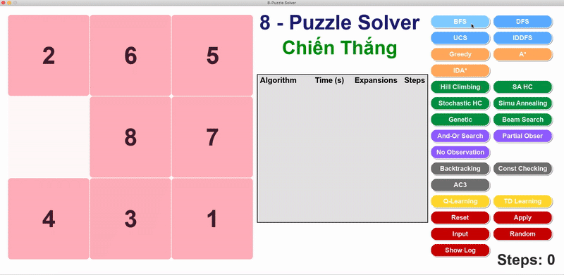  
#### 🔍 DFS  
  
#### 🔍 UCS  
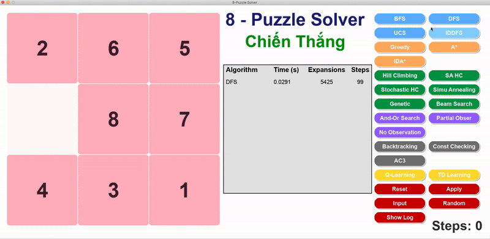  
#### 🔍 IDDFS  
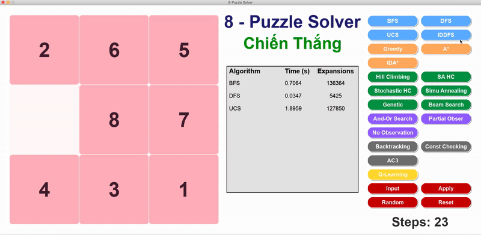

---

### 2.2. Tìm kiếm có thông tin (Informed Search)

#### Mô tả
- **Heuristic**: Manhattan distance.
- **Chi phí**: f(n) = g(n) + h(n)
- **Ghi chú**:
  - Greedy chỉ dùng h(n)
  - A* và IDA* dùng cả g(n) và h(n)

#### Thuật toán
- Greedy
- A*
- IDA*

#### GIF minh họa thuật toán  
#### 🔍 Greedy  
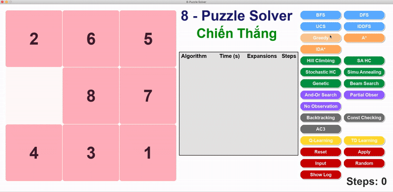  
#### 🔍 A*  
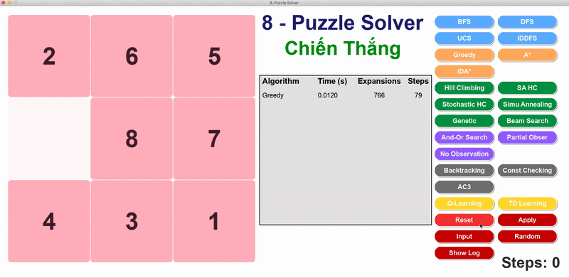  
#### 🔍 IDA*  
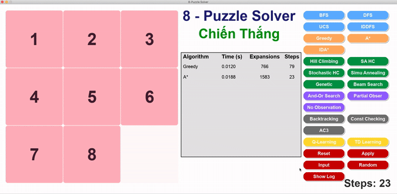

---

### 2.3. Tìm kiếm có ràng buộc (Constraint Satisfaction Search)

#### Mô tả
- **Biến**: X1 đến X9 ứng với 9 ô.
- **Miền giá trị**: 0 đến 8, không trùng.
- **Ràng buộc**:
  - Ngang: bên phải lớn hơn bên trái 1
  - Dọc: dưới lớn hơn trên 3
  - Không trùng giá trị

#### Thuật toán
- Backtracking CSP
- Constraint Checking
- AC-3 (lan truyền ràng buộc)

#### GIF minh họa thuật toán  
#### 🔍 Backtracking CSP  
  
#### 🔍 Constraint Checking  
  
#### 🔍 AC-3  
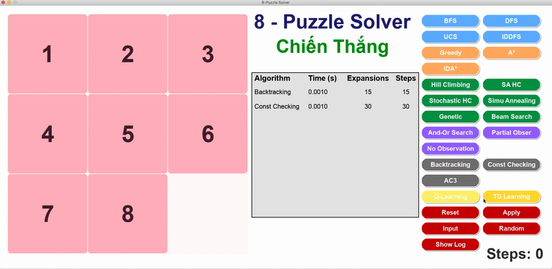

---

### 2.4. Tìm kiếm cục bộ (Local Search)

#### Mô tả
- Tối ưu dần trạng thái hiện tại mà không duyệt toàn bộ không gian.

#### Thuật toán
- Simple Hill Climbing
- Steepest Ascent Hill Climbing
- Stochastic Hill Climbing
- Simulated Annealing
- Genetic Algorithm
- Beam Search

#### GIF minh họa thuật toán  
#### 🔍 Simple Hill Climbing  
  
#### 🔍 Steepest Ascent Hill Climbing  
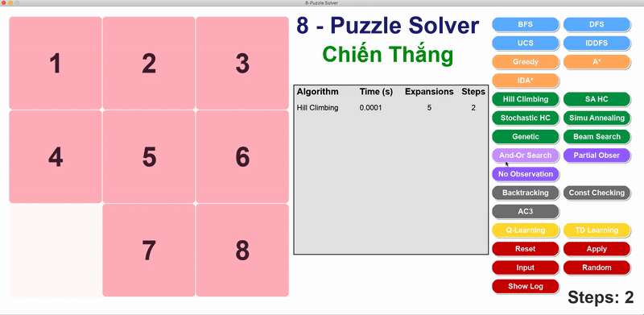  
#### 🔍 Stochastic Hill Climbing  
  
#### 🔍 Simulated Annealing  
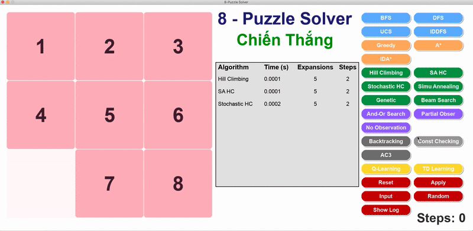  
#### 🔍 Genetic Algorithm  
  
#### 🔍 Beam Search  
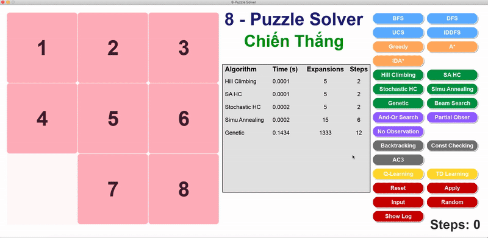

---

### 2.5. Tìm kiếm trong môi trường không xác định (Complex Environments)

#### Mô tả
- Làm việc với tập các trạng thái khả dĩ (belief state) do không biết chính xác trạng thái thật.

#### Thuật toán
- No Observation Search
- Partial Observable Search
- AND-OR Search

#### GIF minh họa thuật toán  
#### 🔍 No Observation Search  
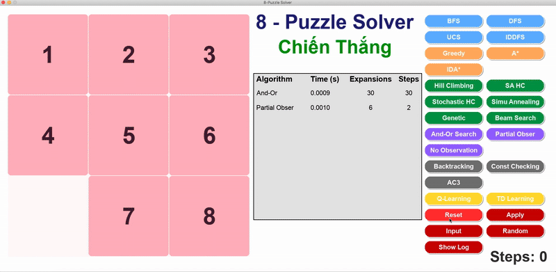  
#### 🔍 Partial Observable Search  
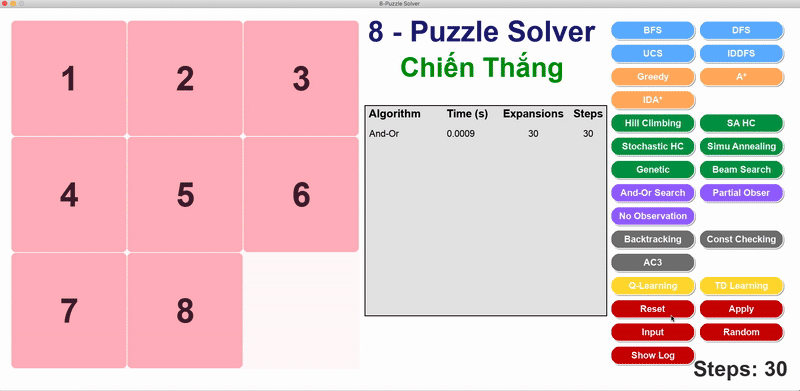  
#### 🔍 AND-OR Search  


---

### 2.6. Học tăng cường (Reinforcement Learning)

#### Mô tả
- Sử dụng Q-Table để học dần chính sách di chuyển tối ưu thông qua phần thưởng.
- Phần thưởng:
  - +100 nếu đến đích
  - -1 cho mỗi bước
- Cập nhật theo công thức:  
  **Q(s, a) = Q(s, a) + α[r + γ·max(Q(s’, a’)) – Q(s, a)]**

#### Thuật toán
- Q-Learning

#### GIF minh họa thuật toán  
#### 🔍 Q-Learning  
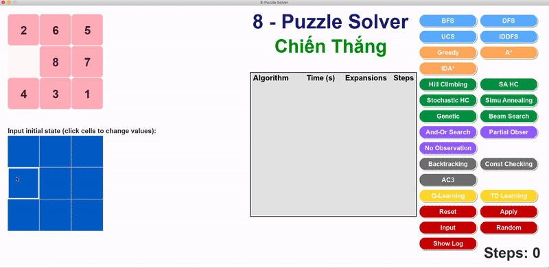

---

## 3. 🚀 Cách chạy chương trình

```bash
# Cài đặt các thư viện cần thiết
pip install pygame

# Chạy ứng dụng
python main.py
```
---

## 4. Kết luận

Dự án **8-Puzzle Visualizer** là minh chứng rõ ràng cho việc vận dụng hiệu quả các thuật toán Trí tuệ Nhân tạo vào một bài toán kinh điển. Qua quá trình xây dựng và hoàn thiện, hệ thống đã đáp ứng được các mục tiêu đề ra:

- **Triển khai toàn diện 6 nhóm thuật toán**: Từ các kỹ thuật tìm kiếm cơ bản như BFS, DFS cho đến các phương pháp nâng cao như A*, Genetic Algorithm và Q-Learning. Mỗi nhóm được thiết kế riêng biệt, thể hiện sự đa dạng trong cách tiếp cận và giải quyết vấn đề.

- **Đánh giá hiệu năng chi tiết**: Mỗi thuật toán đều được kiểm nghiệm dựa trên số bước mở rộng và thời gian xử lý. Nhờ đó, người dùng dễ dàng nhận diện được ưu – nhược điểm trong từng tình huống áp dụng cụ thể.

- **Giao diện trực quan, dễ sử dụng**: Nhờ ứng dụng Pygame, hệ thống mang lại trải nghiệm thân thiện với người dùng. Giao diện hỗ trợ nhập trạng thái tùy chỉnh, lựa chọn thuật toán, xem từng bước giải cùng các chỉ số thống kê quan trọng.

- **Hỗ trợ học tập và thực hành**: Đây không chỉ là một công cụ giải bài toán 8-Puzzle, mà còn là môi trường học tập sinh động, giúp sinh viên trực quan hóa kiến thức AI thông qua mô phỏng, GIF minh họa và phân tích kết quả thực tế. Dự án cũng góp phần rèn luyện kỹ năng lập trình, tư duy thuật toán và khả năng giải quyết vấn đề.

---

## 👤 Tác giả

- **Lê Văn Chiến Thắng**  
- **MSSV:** 23110328  
- **Môn học:** Trí Tuệ Nhân Tạo  
- **Trường:** Đại học Sư phạm Kỹ thuật TP.HCM (HCMUTE)  

---

> © 2025 – Lê Văn Chiến Thắng – HCMUTE
